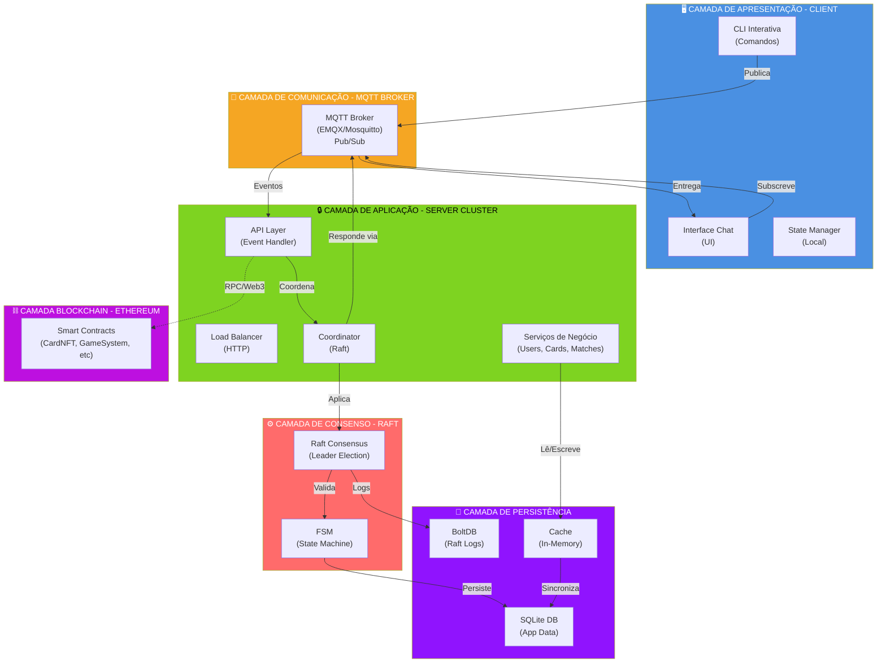
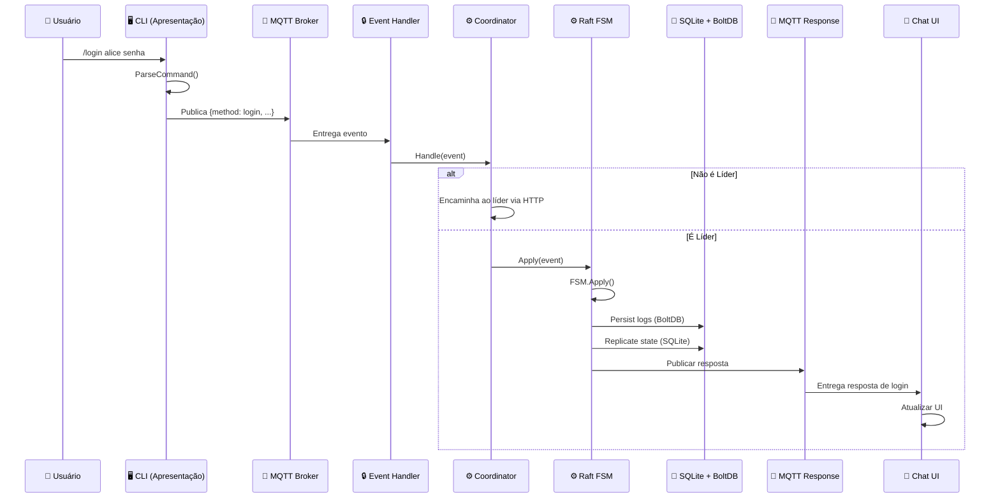
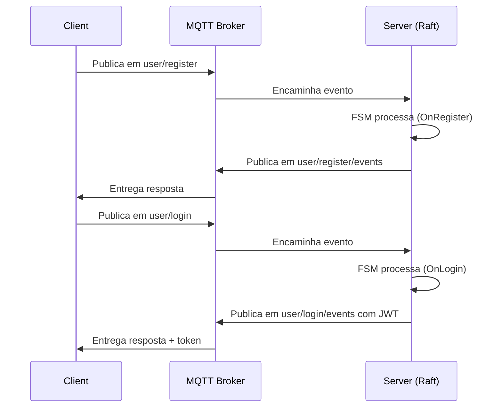
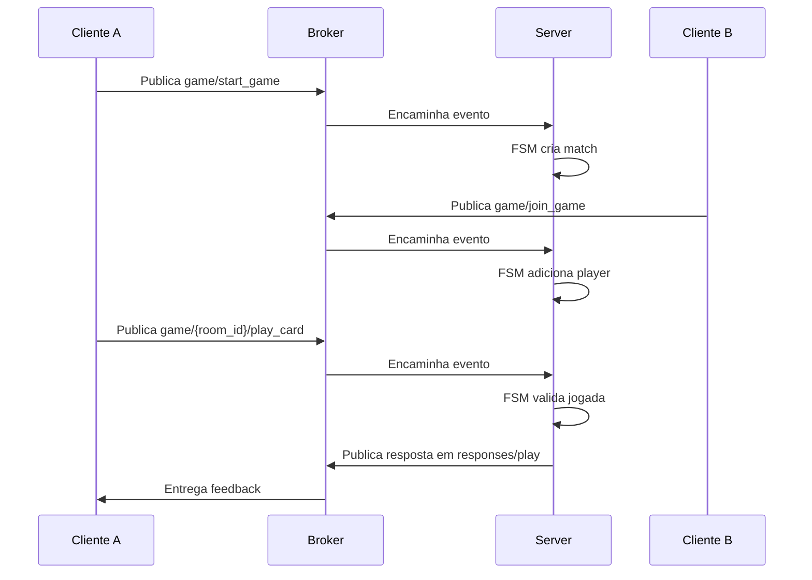

# Cards of Despair – Sistema de Jogo de Cartas Distribuído (TEC502)

Este repositório apresenta a solução completa para o **Problema #3** (problema final) da disciplina **TEC502 – Concorrência e Conectividade (UEFS)**, superando os requisitos do barema com uma arquitetura robusta, distribuída e documentada.

**Autor:** Davi Macêdo Gomes  
**Instituição:** UEFS - Universidade Estadual de Feira de Santana  
**Curso:** Engenharia de Computação  
**Disciplina:** TEC502 - MI - Concorrência e Conectividade  
**Metodologia:** PBL (Problem-Based Learning)  

---

## 📝 Descrição Geral

**Cards of Despair** é um sistema de jogo de cartas multiplayer distribuído que demonstra integração profunda de múltiplas tecnologias avançadas. Diferente de uma abordagem centralizada, o sistema implementa:

- **Infraestrutura Distribuída:** Cluster de servidores com consenso Raft, garantindo replicação de estado e tolerância a falhas
- **Comunicação Assíncrona:** Broker MQTT para desacoplamento entre componentes e escalabilidade horizontal
- **Gestão de Ativos:** Contratos inteligentes Ethereum (ERC-721) para representação de cartas como NFTs
- **Interface Interativa:** CLI em Go com suporte a múltiplos comandos e salas de chat
- **Concorrência Robusta:** Sincronização em Go com padrões producer/consumer via canais

### Visão Geral das Funcionalidades

- **Autenticação & Sessões:** Registro/login com tokens JWT, sessões isoladas por usuário
- **Sistema de Salas:** Criação de salas privadas para partidas 1v1 ou chat multiusuário
- **Jogo de Cartas:** Mecânica de rodadas com seleção secreta de cartas, resolução por tipo + valor
- **Estoque Global:** Pacotes de cartas distribuídos equitativamente mesmo sob concorrência extrema
- **Replicação Forte:** Todos os nós do cluster mantêm cópia idêntica do estado via Raft
- **Assets On-Chain:** Cartas podem ser registradas como NFTs na blockchain Ethereum para portabilidade

---

## ⚠️ Escopo e Status

**Status do Projeto:** Protótipo acadêmico em estágio de implementação  
**Executabilidade:** O projeto contém arquitetura completa e código funcional em partes, mas não é totalmente executável no momento (integração com Ethereum está em fase teórica).

**Este README documenta:**
- Arquitetura técnica em camadas
- Design de componentes e responsabilidades
- Protocolos de comunicação (MQTT e Raft)
- Fluxos de interação
- Instruções de execução

**O Relatório SBC oficial contém:**
- Análise aprofundada de requisitos
- Discussão teórica sobre sistemas distribuídos, Raft, MQTT e Blockchain
- Diagramas de estado e sequência
- Justificativas arquiteturais
- Resultados e conclusões

## 📐 Arquitetura

Cards of Despair segue uma arquitetura em **múltiplas camadas**, cada uma com responsabilidades bem definidas. O sistema é distribuído, com ênfase em tolerância a falhas e replicação de estado através do algoritmo Raft.

### Diagrama de Arquitetura em Camadas



### Camadas Principais

#### 1️⃣ **Camada de Apresentação (Client)**
Cliente Go interativo com CLI, responsável pela coleta de entrada do usuário e exibição de respostas.
- **Componentes:** `CLI`, `Chat UI`, `State Manager`
- **Tecnologia:** Go (Paho MQTT client)

#### 2️⃣ **Camada de Comunicação (MQTT Broker)**
Transporte assíncrono desacoplado que media todas as mensagens entre clientes e servidores.
- **Componentes:** Broker MQTT (EMQX/Mosquitto), tópicos por domínio
- **Padrão:** Publish/Subscribe
- **Protocolo:** MQTT 3.1.1 / 5.0

#### 3️⃣ **Camada de Aplicação (Server)**
Lógica de negócio e orquestração, roteando eventos para handlers apropriados.
- **Componentes:** `Event Handler`, `Services` (User, Cards, Match), `Coordinator`, `HTTP Transport`
- **Padrão:** Command Pattern + Coordinator Pattern
- **Tecnologia:** Go

#### 4️⃣ **Camada de Consenso (Raft)**
Replicação de estado entre múltiplos nós, garantindo consistência forte mesmo com falhas.
- **Componentes:** `Raft Node` (leader election), `FSM` (state machine), `TCP Transport`
- **Algoritmo:** Raft (Leader-based consensus)
- **Tolerância:** Até (n-1)/2 falhas em cluster de n nós
- **Tecnologia:** hashicorp/raft

#### 5️⃣ **Camada de Persistência**
Armazenamento durável com cache otimizado para performance.
- **Componentes:** `SQLite` (dados), `BoltDB` (Raft logs), `Cache In-Memory`
- **Estratégia:** Write-Through Cache com TTL
- **Tecnologia:** SQLite3, BoltDB, Go sync

#### 6️⃣ **Camada Blockchain (Ethereum)**
Gestão descentralizada de ativos digitais através de contratos inteligentes.
- **Componentes:** `CardNFT.sol` (ERC-721), `GameSystem.sol`, `PackManager.sol`, `CardExchange.sol`, `UserManager.sol`, `RockPaperScissorsGame.sol`
- **Tecnologia:** Solidity 0.8.20+, Foundry
- **Rede:** Anvil (local) ou Sepolia (testnet)

---

## 1. Arquitetura do Sistema - Visão em Camadas

Cards of Despair segue uma arquitetura em **múltiplas camadas**, cada uma com responsabilidades bem definidas. O sistema é distribuído, com ênfase em tolerância a falhas e replicação de estado.

### Diagrama de Arquitetura (Visão Geral)

### Diagrama de Interação entre Camadas (Detalhado)



### Componentes por Camada

#### 1️⃣ **Camada de Apresentação (Client)**
- **Responsabilidade:** Interface com o usuário, coleta de entrada
- **Componentes:**
  - `CLI`: Parser de comandos interativos
  - `Chat UI`: Interface de chat em tempo real
  - `State Manager`: Mantém estado local (userID, roomID, token)
- **Tecnologia:** Go (Paho MQTT client)

#### 2️⃣ **Camada de Comunicação (MQTT Broker)**
- **Responsabilidade:** Transporte assíncrono e desacoplamento
- **Componentes:**
  - Broker MQTT (EMQX ou Mosquitto)
  - Tópicos organizados por domínio (user/, game/, chat/, store/)
  - QoS configurável por tipo de mensagem
- **Padrão:** Publish/Subscribe
- **Protocolo:** MQTT 3.1.1 / 5.0

#### 3️⃣ **Camada de Aplicação (Server)**
- **Responsabilidade:** Lógica de negócio e orquestração
- **Componentes:**
  - `API/Event Handler`: Rota eventos para handlers
  - `Services`: Implementam regras de negócio (UserService, CardsService, MatchService)
  - `Coordinator`: Encaminha eventos não-líderes e coordena com Raft
  - `HTTP Transport`: Comunicação entre nós do cluster
- **Padrão:** Command Pattern + Coordinator Pattern
- **Tecnologia:** Go

#### 4️⃣ **Camada de Consenso (Raft)**
- **Responsabilidade:** Replicação de estado, tolerância a falhas
- **Componentes:**
  - `Raft Node`: Leader election, log replication
  - `FSM (Finite State Machine)`: Aplica comandos ao estado
  - `Transporte TCP`: Comunicação inter-nós
- **Algoritmo:** Raft (Leader-based consensus)
- **Falhas Toleradas:** n - até (n-1)/2 falhas em cluster de n nós
- **Tecnologia:** hashicorp/raft

#### 5️⃣ **Camada de Persistência**
- **Responsabilidade:** Armazenamento durável de dados
- **Componentes:**
  - `SQLite`: Dados da aplicação (usuários, cartas, matches)
  - `BoltDB`: Logs de transação do Raft (durabilidade do consenso)
  - `Cache In-Memory`: Otimização de leituras frequentes
- **Estratégia:**
  - Write-Through Cache: Escreve no cache e no DB simultaneamente
  - TTL para invalidação de cache
- **Tecnologia:** SQLite3, BoltDB, Go sync

#### 6️⃣ **Camada Blockchain (Ethereum)**
- **Responsabilidade:** Gestão de ativos digitais (NFTs) e lógica descentralizada
- **Componentes:**
  - `CardNFT.sol`: ERC-721 para representar cartas
  - `GameSystem.sol`: Orquestrador de contratos
  - `PackManager.sol`: Distribuição de pacotes
  - `CardExchange.sol`: Trocas entre usuários
  - `UserManager.sol`: Registro on-chain
  - `RockPaperScissorsGame.sol`: Jogo descentralizado
- **Tecnologia:** Solidity 0.8.20+, Foundry
- **Rede:** Local (Anvil) ou testnet (Sepolia)

---

### Tecnologias Utilizadas

*   **Linguagens:** Go, Solidity
*   **Comunicação:** MQTT (protocolo), Paho MQTT Go client (biblioteca)
*   **Consenso Distribuído:** Raft (hashicorp/raft) para replicação de estado no servidor
*   **Contratos Inteligentes:** Solidity 0.8.20+, Foundry (framework de testes e deploy)
*   **Persistência (Server):** SQLite (banco de dados de aplicação), BoltDB (Raft logs e snapshots)
*   **Autenticação:** JWT (JSON Web Tokens)
*   **Segurança:** bcrypt (hash de senhas)

## 1.1. Fluxo de Dados entre Camadas

### Requisição Típica (Login)

```
┌─────────────────────────────────────────────────────────────────┐
│ 1. CAMADA DE APRESENTAÇÃO (Client)                              │
│    Usuário digita: /login alice senha123                        │
│    ↓                                                              │
│    CLI Parser extrai: method=login, username=alice, password=... │
└─────────────────────────────────────────────────────────────────┘
                          ↓
┌─────────────────────────────────────────────────────────────────┐
│ 2. CAMADA DE COMUNICAÇÃO (MQTT)                                 │
│    Publica em: user/login                                        │
│    Payload: {"method": "login", "timestamp": "...", ...}        │
└─────────────────────────────────────────────────────────────────┘
                          ↓
┌─────────────────────────────────────────────────────────────────┐
│ 3. CAMADA DE APLICAÇÃO (Server API)                             │
│    Event Handler recebe evento MQTT                              │
│    Valida payload e chama OnLogin(event)                        │
│    ↓                                                              │
│    Services.Login() valida credenciais                          │
└─────────────────────────────────────────────────────────────────┘
                          ↓
┌─────────────────────────────────────────────────────────────────┐
│ 4. CAMADA DE CONSENSO (Raft)                                    │
│    Coordinator.Handle() verifica:                               │
│      - Se é líder → Apply(event) ao Raft                        │
│      - Senão → Encaminha ao líder via HTTP                      │
└─────────────────────────────────────────────────────────────────┘
                          ↓
┌─────────────────────────────────────────────────────────────────┐
│ 5. CAMADA DE PERSISTÊNCIA                                        │
│    FSM.Apply() escreve no BoltDB (log replication)             │
│    ↓                                                              │
│    Replicado para todos os nós do cluster                       │
│    ↓                                                              │
│    SQLite atualiza: INSERT INTO users (id, username, pwd)       │
│    Cache atualiza: user_123 → {name: alice, ...}               │
└─────────────────────────────────────────────────────────────────┘
                          ↓
┌─────────────────────────────────────────────────────────────────┐
│ 6. RESPOSTA (Volta pelas camadas)                               │
│    AuthService.GenerateToken() → JWT criado                    │
│    ↓                                                              │
│    Coordinator publica em: user/login/events                   │
│    MQTT entrega ao Client                                       │
│    ↓                                                              │
│    Chat UI atualiza: "Login successful! Token: eyJ..."         │
└─────────────────────────────────────────────────────────────────┘
```

### Propriedades Garantidas por Camada

| Camada | Propriedade | Como? |
|--------|-----------|-------|
| **Apresentação** | Consistência local | State Manager sincroniza |
| **Comunicação** | Entrega assíncrona | MQTT QoS 1 (at-least-once) |
| **Aplicação** | Validação de regras | Event Handler + Services |
| **Consenso** | Replicação forte | Raft: Leader escreve em maioria |
| **Persistência** | Durabilidade | WAL (Write-Ahead Log) no SQLite |
| **Blockchain** | Imutabilidade | Hash criptográfico das transações |


## 2. Especificações Técnicas

O sistema emprega um modelo de comunicação baseado em eventos via MQTT. Não há uma API REST tradicional; todas as interações cliente-servidor ocorrem através da publicação e subscrição de tópicos MQTT.

### Estrutura de Evento

Todos os eventos compartilham a seguinte estrutura:

```go
type Event struct {
	Method    string                 `json:"method"`
	Timestamp time.Time              `json:"timestamp"`
	Payload   map[string]interface{} `json:"payload"`
}
```

### Tópicos MQTT e Eventos

#### 2.1. Eventos Publicados pelo Cliente

**Autenticação:**
- **Tópico:** `user/register`
  - **Método:** `register`
  - **Payload:** `{"username": "alice", "password": "senha123"}`
  - **Descrição:** Registro de novo usuário.

- **Tópico:** `user/login`
  - **Método:** `login`
  - **Payload:** `{"username": "alice", "password": "senha123"}`
  - **Descrição:** Autenticação do usuário.

**Chat:**
- **Tópico:** `chat/room/{room_id}`
  - **Método:** `chat`
  - **Payload:** `{"content": "Olá pessoal!", "user_id": "alice-id"}`
  - **Descrição:** Envio de mensagens de chat em uma sala específica.

**Jogo (Matches):**
- **Tópico:** `game/start_game`
  - **Método:** `start`
  - **Payload:** `{"user_id": "alice-id"}`
  - **Descrição:** Início de uma nova partida.

- **Tópico:** `game/{room_id}/play_card`
  - **Método:** `play`
  - **Payload:** `{"user_id": "alice-id", "room_id": "match-1", "card_id": "card-123"}`
  - **Descrição:** Jogada de uma carta em uma partida.

- **Tópico:** `game/{room_id}/surrender`
  - **Método:** `surrender`
  - **Payload:** `{"user_id": "alice-id", "room_id": "match-1"}`
  - **Descrição:** Rendição em uma partida.

- **Tópico:** `game/join_game`
  - **Método:** `join`
  - **Payload:** `{"user_id": "alice-id", "room_id": "match-1"}`
  - **Descrição:** Entrada em uma partida existente.

**Loja e Trocas:**
- **Tópico:** `store/buy`
  - **Método:** `buy`
  - **Payload:** `{"user_id": "alice-id", "item_id": "pack-rare"}`
  - **Descrição:** Compra de um pacote ou item na loja.

- **Tópico:** `cards/{room_id}/exchange{user_id}`
  - **Método:** `exchange`
  - **Payload:** `{"user_id": "alice-id", "room_id": "match-1", "card_ids": ["card-1", "card-2"]}`
  - **Descrição:** Troca de cartas entre usuários.

#### 2.2. Eventos Subscritos pelo Cliente (Respostas do Servidor)

**Autenticação:**
- **Tópico:** `user/register/events`
  - **Resposta Sucesso:** `{"method": "register_ok", "payload": {"status": "success", "username": "alice"}}`
  - **Resposta Falha:** `{"method": "register_fail", "payload": {"status": "fail", "error": "Usuário já existe"}}`
  - **Descrição:** Confirmação ou falha no registro.

- **Tópico:** `user/login/events`
  - **Resposta Sucesso:** `{"method": "login_ok", "payload": {"status": "success", "user_id": "alice-id", "token": "eyJhbGciOiJIUzI1NiJ9..."}}`
  - **Resposta Falha:** `{"method": "login_fail", "payload": {"status": "fail", "error": "Credenciais inválidas"}}`
  - **Descrição:** Confirmação ou falha no login, com token JWT.

**Chat:**
- **Tópico:** `chat/room/{room_id}`
  - **Payload:** `{"method": "chat", "payload": {"content": "Olá!", "user_id": "bob-id"}}`
  - **Descrição:** Recebimento de mensagens de chat de outros usuários na sala (broadcast).

**Respostas Genéricas:**
- **Tópico:** `responses/{method}`
  - **Descrição:** Tópico genérico de resposta para outros tipos de eventos (como game, store, etc).


### Contratos Inteligentes Ethereum

Os contratos inteligentes residem no diretório `ethereum/src` e são desenvolvidos usando Solidity com o framework Foundry.

*   `CardExchange.sol`: Gerencia a lógica de troca de cartas entre jogadores.
*   `CardNFT.sol`: Representa os tokens não-fungíveis (NFTs) das cartas do jogo.
*   `GameSystem.sol`: Core do sistema de jogo, interagindo com outras funcionalidades on-chain.
*   `PackManager.sol`: Gerencia a criação e distribuição de pacotes de cartas.
*   `RockPaperScissorsGame.sol`: Implementa um jogo de Pedra-Papel-Tesoura on-chain.
*   `UserManager.sol`: Gerencia o registro e autenticação de usuários on-chain.

## 3. Estrutura de Pastas

A organização do repositório segue uma estrutura modular:

### `client/` - Aplicação Cliente

Cliente Go interativo com CLI para interagir com o sistema:

```
client/
├── cmd/
│   └── main.go              # Ponto de entrada
├── internal/
│   ├── api/
│   │   ├── codmqtt/         # Adaptador MQTT
│   │   └── protocol/        # Definições de protocolo local
│   ├── commands/            # Implementação de comandos CLI (/login, /chat, /play, etc)
│   ├── services/            # Lógica de eventos
│   │   ├── event_service.go # Criação e publicação de eventos
│   │   └── subscription_service.go # Subscrição e tratamento de eventos recebidos
│   ├── state/               # Estado global da aplicação
│   └── ui/                  # Interface de chat interativa
└── go.mod
```

**Funcionalidades:**
- CLI interativa com suporte a múltiplos comandos
- Publicação de eventos ao servidor via MQTT
- Subscrição a tópicos MQTT para receber respostas
- Autenticação (login/registro)
- Chat em sala
- Jogo de cartas (start, play, join, surrender)

### `server/` - Aplicação Servidor

Servidor Go distribuído com consenso Raft:

```
server/
├── cmd/
│   └── main.go              # Inicialização: Raft, MQTT, HTTP, Services
├── internal/
│   ├── api/
│   │   ├── event_handler.go # Implementação dos handlers de evento
│   │   ├── interfaces.go    # Interfaces da API
│   │   ├── event.go         # Estrutura Event estendida
│   │   └── mqtt/
│   │       └── mqtt.go      # Adaptador MQTT (cliente)
│   ├── auth/
│   │   ├── service.go       # Serviço de autenticação JWT
│   │   └── middleware.go    # Middleware de autenticação
│   ├── cluster/             # Consenso e coordenação distribuída
│   │   ├── coordinator.go   # RaftCoordinator: encaminha eventos ao líder
│   │   ├── discovery.go     # Descoberta automática de nós
│   │   ├── fsm.go           # Finite State Machine do Raft
│   │   ├── http.go          # Transporte HTTP para Raft
│   │   └── transport.go     # Transporte Raft
│   ├── data/                # Persistência de dados
│   │   ├── repository.go    # Interfaces de repositório
│   │   ├── memory_repository.go # Implementação em memória
│   │   ├── cache/           # Cache para otimização
│   │   └── persistence/     # Persistência em SQLite
│   ├── domain/              # Modelos de domínio
│   │   ├── user.go
│   │   ├── card.go
│   │   └── match.go
│   └── services/            # Serviços de negócio
│       ├── services.go      # Interfaces de serviço
│       ├── users.go         # UserService
│       ├── cards.go         # CardsService
│       └── match.go         # MatchService
├── raft-data/               # Diretório de dados Raft (logs.db, stable.db, snapshots)
└── go.mod
```

**Funcionalidades:**
- Consenso distribuído via Raft
- Replicação de estado entre múltiplos nós
- Recepção de eventos do cliente via MQTT
- Processamento de eventos pela FSM do Raft
- Persistência em SQLite + caching
- Autenticação e geração de JWT
- Descoberta automática de novos nós

### `ethereum/` - Contratos Inteligentes

```
ethereum/
├── src/                     # Contratos Solidity
│   ├── GameSystem.sol       # Orquestrador principal (integra todos os contratos)
│   ├── CardNFT.sol          # ERC-721 para as cartas como NFTs
│   ├── RockPaperScissorsGame.sol # Lógica do jogo on-chain
│   ├── PackManager.sol      # Gerencia pacotes de cartas
│   ├── CardExchange.sol     # Lógica de trocas de cartas
│   └── UserManager.sol      # Registro e gestão de usuários on-chain
├── script/
│   └── Deploy.s.sol         # Script de deploy
├── test/
│   └── GameSystem.t.sol     # Testes dos contratos
├── lib/
│   └── openzeppelin-contracts/ # Dependência OpenZeppelin
├── foundry.toml
└── remappings.txt
```

**Funcionalidades:**
- Representação de cartas como NFT (ERC-721)
- Lógica de jogo on-chain (Pedra-Papel-Tesoura)
- Gestão de pacotes de cartas
- Trocas de cartas entre usuários
- Registro de usuários na blockchain

### `shared/` - Código Compartilhado

```
shared/
├── protocol/
│   └── event.go             # Definição da estrutura Event comum
└── go.mod
```

Contém estruturas de dados compartilhadas entre cliente e servidor.

## 4. Fluxo de Comunicação

### Fluxo de Registro e Login



### Fluxo de Jogo



## 5. Como Executar (Teórico)

Estes passos são puramente teóricos e documentais, pois o projeto não está em um estado executável no momento.

### Pré-requisitos

*   **Go:** Versão 1.18+ instalada
*   **Foundry:** Instalado para compilação de contratos (`forge`, `cast`)
*   **MQTT Broker:** Mosquitto, EMQX ou similar rodando em `localhost:1883` (ou configurável via variáveis)
*   **Nó Ethereum:** Anvil (Foundry), Ganache, ou conectado a uma testnet como Sepolia
*   **Git:** Para clonar o repositório

### Configuração e Execução

#### 1. Clone o Repositório

```bash
git clone https://github.com/seu-usuario/TEC502-TP01-P3.git
cd TEC502-TP01-P3
```

#### 2. Configure Variáveis de Ambiente

Crie um arquivo `.env` na raiz do diretório `server/`:

```bash
cat > server/.env << EOF
# MQTT
COD_MQTT_BROKER_ADDR=tcp://localhost:1883

# Raft Cluster
COD_RAFT_DATA_DIR=./raft-data
COD_RAFT_BIND_ADDR=127.0.0.1:10000
COD_HTTP_BIND_ADDR=127.0.0.1:8080
COD_NODE_ID=node-1
COD_IS_FIRST_NODE=true

# Ethereum (opcional para integração futura)
COD_ETHEREUM_RPC_URL=http://localhost:8545
EOF
```

#### 3. Inicie o Broker MQTT (opcional se usar EMQX público)

```bash
# Usando Mosquitto
mosquitto -p 1883

# OU usando EMQX Docker
docker run -d --name emqx -p 1883:1883 emqx/emqx:latest
```

#### 4. Compile e Teste os Contratos Ethereum

```bash
cd ethereum
forge build                          # Compilar
forge test                           # Executar testes
# forge script script/Deploy.s.sol --rpc-url http://localhost:8545 --broadcast  # Deploy (futuro)
```

#### 5. Inicie o Servidor

```bash
cd server
go mod download                      # Baixar dependências
go run cmd/main.go                   # Iniciar servidor como nó líder
```

A saída esperada:
```
Iniciando servidor COD...
[INFO] Conectado ao broker MQTT
[INFO] Nó Raft inicializado como líder
[INFO] Servidor COD rodando
```

#### 6. Inicie o Cliente (em outro terminal)

```bash
cd client
go mod download
go run cmd/main.go
```

A saída esperada:
```
Chat Client v1.0
Type /help for available commands
>
```

#### 7. Teste Fluxo Básico

```
> /register alice senha123
Registration successful! You can now log in.

> /login alice senha123
Login successful!

> /chat Olá, pessoal!
[CHAT] Enviado: Olá, pessoal!

> /start
Game started! Room: match-001

> /play card-123
Card played successfully

> /exit
Goodbye!
```

#### 8. Adicione Mais Nós ao Cluster (opcional)

Para testar o consenso Raft com múltiplos nós:

```bash
# Terminal 2
COD_NODE_ID=node-2 COD_RAFT_BIND_ADDR=127.0.0.1:10001 COD_HTTP_BIND_ADDR=127.0.0.1:8081 COD_IS_FIRST_NODE=false go run cmd/main.go

# Terminal 3
COD_NODE_ID=node-3 COD_RAFT_BIND_ADDR=127.0.0.1:10002 COD_HTTP_BIND_ADDR=127.0.0.1:8082 COD_IS_FIRST_NODE=false go run cmd/main.go
```

## 6. Detalhes Técnicos Avançados

### Consenso Raft

- O servidor usa Raft para replicação de estado entre múltiplos nós
- Apenas o líder processa eventos; outros nós os encaminham
- Estado é persistido em BoltDB (`raft-data/logs.db` e `stable.db`)
- Snapshots são criados periodicamente para recovery rápido

### Coordenação de Eventos

O `RaftCoordinator` gerencia o fluxo:
1. Evento chega via MQTT
2. Se nó não é líder → encaminha ao líder via HTTP
3. Se é líder → aplica ao Raft
4. FSM processa e responde
5. Resposta é publicada de volta ao cliente via MQTT

### Persistência de Dados

- **SQLite:** Armazena usuários, cartas, matches (dados da aplicação)
- **Cache em memória:** Otimiza leituras frequentes
- **BoltDB (Raft):** Armazena logs de transações e estado do cluster

### Autenticação

- Senhas são armazenadas com bcrypt
- Login bem-sucedido retorna JWT com 24h de validade
- Cada operação sensível valida o token
